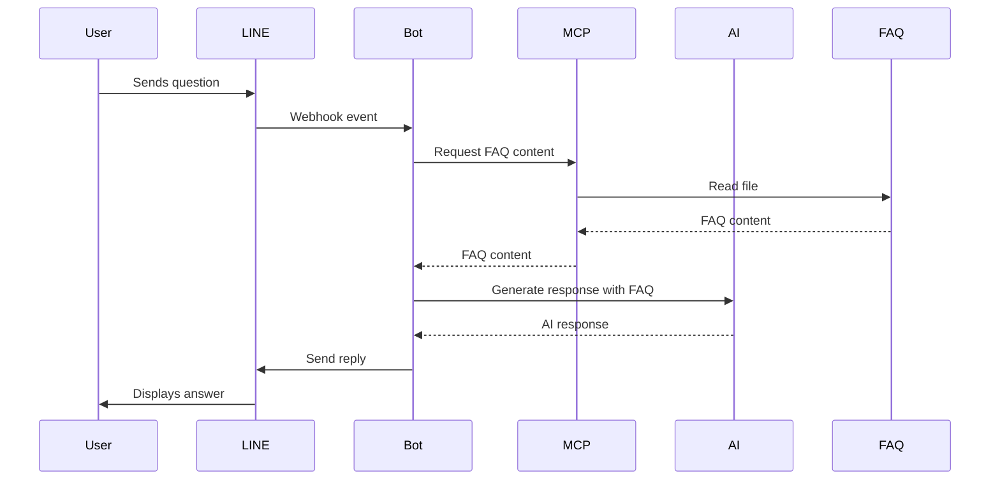

# Shippop LINE MCP Bot

A proof of concept LINE bot that uses the Model Context Protocol (MCP) to automatically answer customer service questions using an FAQ document, demonstrating how AI can reduce CS workload.

## 🎯 Project Overview

This bot demonstrates:
- **24/7 Automated Support**: Instant responses to common customer questions
- **FAQ-Based Answers**: Uses comprehensive FAQ document as knowledge base
- **Bilingual Support**: Responds in Thai and English
- **Analytics Tracking**: Monitors resolution rates and CS time savings
- **Smart Escalation**: Escalates to human agents when needed

## 📋 Prerequisites

Before you begin, ensure you have:

1. **Node.js** v18+ installed ([Download here](https://nodejs.org/))
2. **LINE Official Account** ([Create free account](https://manager.line.biz/))
3. **LINE Developers Console Access** ([Console](https://developers.line.biz/console/))
4. **OpenAI API Key** ([Get API key](https://platform.openai.com/api-keys))

## 🚀 Quick Start

### 1. Install Dependencies

```bash
cd /Users/bowlingnoi/Project/shippop-mysave.cc/my_adhoc/line_mcp
npm install
```

### 2. Configure Environment

Copy `.env.example` to `.env` and fill in your credentials:

```bash
cp .env.example .env
```

Edit `.env` with your actual values:

```env
PORT=3000
NODE_ENV=development

# Get from LINE Developers Console
LINE_CHANNEL_ACCESS_TOKEN=your_actual_token_here
LINE_CHANNEL_SECRET=your_actual_secret_here

# Get from OpenAI Platform
OPENAI_API_KEY=sk-your_actual_key_here
OPENAI_MODEL=gpt-4o-mini

FAQ_FILE_PATH=./data/faq.md
LOG_LEVEL=info
```

### 3. Start the Server

```bash
npm start
```

You should see:

```
🚀 Shippop LINE MCP Bot Server
========================================
Server running on port 3000
Health check: http://localhost:3000/
Analytics: http://localhost:3000/analytics
Webhook endpoint: http://localhost:3000/webhook
========================================
```

### 4. Expose Local Server with ngrok

To connect LINE to your local server, use ngrok:

```bash
# Install ngrok if you haven't: https://ngrok.com/download
ngrok http 3000
```

Copy the HTTPS URL (e.g., `https://abc123.ngrok.io`)

### 5. Configure LINE Webhook

1. Go to [LINE Developers Console](https://developers.line.biz/console/)
2. Select your channel
3. Go to **Messaging API** tab
4. Set **Webhook URL**: `https://your-ngrok-url.ngrok.io/webhook`
5. Click **Verify** (should show success)
6. Enable **Use webhook**
7. Disable **Auto-reply messages** (to let bot handle all messages)

### 6. Test the Bot!

1. Add your LINE Official Account as a friend
2. Send a message: "What are the shipping rates?"
3. Bot should respond with FAQ information!

## 📁 Project Structure

```
line_mcp/
├── package.json              # Dependencies and scripts
├── .env.example             # Environment template
├── .env                     # Your actual config (gitignored)
├── README.md                # This file
├── src/
│   ├── server.js           # Main Express server
│   ├── handlers/
│   │   └── messageHandler.js    # LINE message processing
│   ├── services/
│   │   ├── aiService.js         # OpenAI integration
│   │   └── mcpService.js        # FAQ resource management
│   └── utils/
│       └── analytics.js         # Metrics tracking
├── data/
│   └── faq.md              # FAQ document (customize this!)
└── docs/
    └── DEPLOYMENT.md       # Production deployment guide
```

## 🔧 How It Works



1. **User sends message** to LINE Official Account
2. **LINE forwards** message to webhook endpoint
3. **Bot receives** message and loads FAQ via MCP Service
4. **AI Service** generates response using FAQ context
5. **Bot sends** reply back through LINE
6. **Analytics** tracks metrics (auto-resolved vs escalated)

## 📊 Monitoring & Analytics

### View Analytics Dashboard

Visit `http://localhost:3000/analytics` to see:

```json
{
  "metrics": {
    "totalQueries": 42,
    "autoResolved": 35,
    "escalated": 7,
    "resolutionRate": 83.33,
    "uptimeMinutes": 120
  },
  "savings": {
    "autoResolvedCases": 35,
    "hoursSaved": "8.75",
    "estimatedCostSaved": "175.00",
    "currency": "USD"
  }
}
```

### Console Output

The server prints analytics summaries every 10 queries:

```
========================================
📊 ANALYTICS SUMMARY
========================================
Total Queries:      20
✅ Auto-Resolved:   16 (80.00%)
👤 Escalated:       4 (20.00%)
❌ Errors:          0 (0.00%)
⏱️  Uptime:          45 minutes
========================================
```

## 🎨 Customizing the FAQ

Edit `data/faq.md` to add your own questions and answers:

```markdown
## Your Custom Section

**Q: Your question here?**
A: Your detailed answer here...
```

The bot automatically:
- Loads FAQ updates (with 5-minute cache)
- Answers based on FAQ content
- Escalates when answer not found

## 🧪 Testing

### Test FAQ Loading

```bash
node -e "import('./src/services/mcpService.js').then(m => m.default.getFAQContent().then(c => console.log('FAQ loaded:', c.length, 'chars')))"
```

### Test Server Health

```bash
curl http://localhost:3000/
```

### Test with Example Messages

Send these to your bot:
- ✅ "What are the shipping rates?" (should auto-resolve)
- ✅ "How long does delivery take?" (should auto-resolve)
- ⚠️ "What's your favorite color?" (should escalate)

## 🚨 Troubleshooting

### Bot not responding

**Check:**
1. Server is running (`npm start`)
2. ngrok is active and URL is correct
3. LINE webhook is enabled
4. Webhook URL verification succeeded
5. Check server logs for errors

### Getting 401/403 errors

**Fix:**
- Verify `LINE_CHANNEL_ACCESS_TOKEN` in `.env` is correct
- Verify `LINE_CHANNEL_SECRET` matches your channel

### AI not generating responses

**Fix:**
- Verify `OPENAI_API_KEY` in `.env` is valid
- Check OpenAI account has available credits
- Review server logs for API errors

### FAQ not loading

**Fix:**
- Verify `FAQ_FILE_PATH` points to correct file
- Check file exists: `ls data/faq.md`
- Check file permissions

## 📈 Expected Results

Based on typical implementations:

| Metric | Before Bot | After Bot | Improvement |
|--------|-----------|-----------|-------------|
| Monthly CS tickets | 1,000 | 300 | 70% reduction |
| Avg response time | 15 min | Instant | 100% faster |
| Monthly CS hours | 250 hrs | 75 hrs | 175 hrs saved |
| Estimated cost | $5,000 | $1,500 | $3,500 saved |

## 🔐 Security Notes

- Never commit `.env` file to version control
- Keep API keys secure
- Use HTTPS for webhook (ngrok provides this)
- Validate webhook signatures in production
- Rate limit webhook endpoint in production

## 📚 Additional Resources

- [LINE Messaging API Docs](https://developers.line.biz/en/docs/messaging-api/)
- [Model Context Protocol](https://modelcontextprotocol.io/)
- [OpenAI API Documentation](https://platform.openai.com/docs)
- [Deployment Guide](./docs/DEPLOYMENT.md)

## 🤝 Support

For questions or issues:
- Check server logs
- Review LINE webhook logs in console
- Contact: support@shippop.com

## 📝 License

MIT License - Feel free to use and modify for your needs!

---

**Made with ❤️ by Shippop Team**
