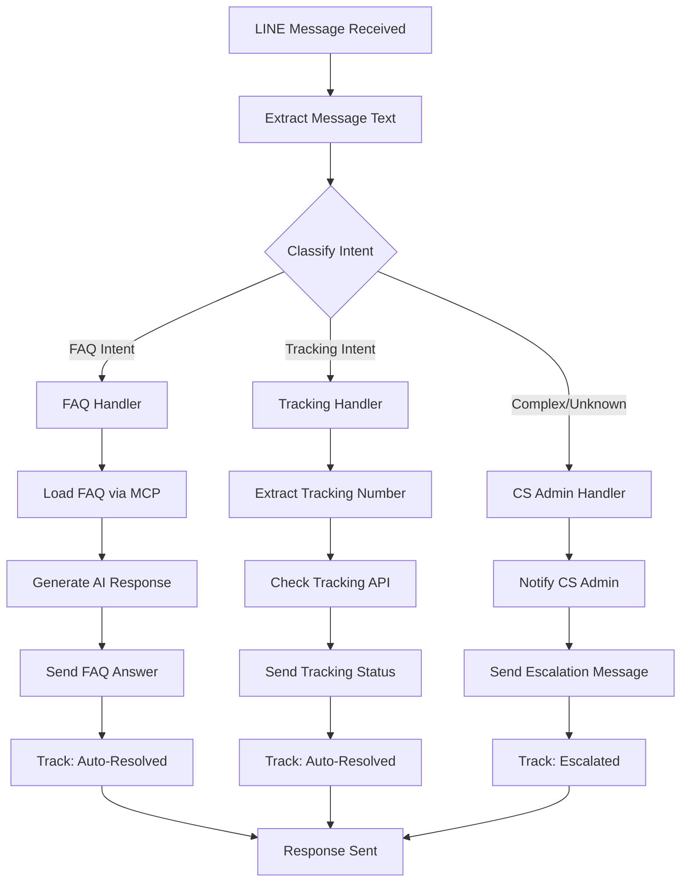

# Message Classification & Routing Flow

This document explains how incoming LINE messages are classified and routed to the appropriate handler (FAQ, Tracking, or CS Admin).

## Message Classification Flow Diagram



## Intent Classification Logic

### 1. FAQ Intent Keywords

Messages that can be answered using the FAQ document:

**Thai:**
- `ราคา`, `ค่าส่ง`, `เท่าไหร่` → Shipping rates
- `นาน`, `จัดส่ง`, `ระยะเวลา` → Delivery time
- `ยืนยันตัวตน`, `สมัคร`, `บัญชี COD` → Account/verification
- `เอกสาร`, `ต้องใช้อะไร` → Required documents
- `ชำระเงิน`, `วิธีจ่าย` → Payment methods

**English:**
- `rate`, `price`, `cost`, `how much` → Shipping rates
- `delivery`, `shipping time`, `how long` → Delivery time
- `verify`, `account`, `COD` → Account/verification
- `payment`, `pay` → Payment methods

### 2. Tracking Intent Keywords

Messages requesting tracking information:

**Thai:**
- `ติดตาม`, `เช็ค`, `ตรวจสอบ` + number
- `พัสดุของฉัน`, `ของฉันถึงไหนแล้ว`
- Pattern: `[A-Z0-9]{10,}` (tracking number)

**English:**
- `track`, `tracking`, `check` + number
- `where is my package`
- Pattern: tracking number format

### 3. CS Admin Escalation

Messages that require human intervention:

- Order-specific issues (refund, complaint)
- Complex technical problems
- Personal account modifications
- Custom requests
- No clear intent detected

## Code Implementation

### File Structure

```
src/
├── handlers/
│   └── messageHandler.js       # Main orchestrator
├── services/
│   ├── intentClassifier.js     # NEW: Classifies message intent
│   ├── trackingService.js      # NEW: Handles tracking queries
│   ├── mcpService.js           # FAQ resource
│   └── aiService.js            # AI responses
```

### Intent Classifier Service

**Purpose:** Analyze message and determine which handler to use

```javascript
// src/services/intentClassifier.js

class IntentClassifier {
  classifyIntent(message) {
    const lowerMessage = message.toLowerCase();
    
    // 1. Check for Tracking Intent
    if (this.isTrackingIntent(lowerMessage)) {
      return {
        type: 'TRACKING',
        confidence: 0.9,
        trackingNumber: this.extractTrackingNumber(message)
      };
    }
    
    // 2. Check for FAQ Intent
    if (this.isFAQIntent(lowerMessage)) {
      return {
        type: 'FAQ',
        confidence: 0.85,
        category: this.getFAQCategory(lowerMessage)
      };
    }
    
    // 3. Default to Escalation
    return {
      type: 'ESCALATE',
      confidence: 0.5,
      reason: 'No clear intent detected'
    };
  }
  
  isTrackingIntent(message) {
    const trackingKeywords = [
      'ติดตาม', 'เช็ค', 'ตรวจสอบ', 'track', 'check',
      'where is', 'ของฉันถึง', 'พัสดุ'
    ];
    
    const hasKeyword = trackingKeywords.some(kw => 
      message.includes(kw)
    );
    
    const hasTrackingNumber = /[A-Z0-9]{10,}/.test(message);
    
    return hasKeyword || hasTrackingNumber;
  }
  
  isFAQIntent(message) {
    const faqKeywords = [
      // Rates
      'ราคา', 'ค่าส่ง', 'เท่าไหร่', 'rate', 'price', 'cost',
      // Time
      'นาน', 'จัดส่ง', 'delivery', 'time',
      // Account
      'สมัคร', 'ยืนยัน', 'บัญชี', 'account', 'verify', 'cod',
      // Documents
      'เอกสาร', 'ต้องใช้', 'document', 'required'
    ];
    
    return faqKeywords.some(kw => message.includes(kw));
  }
}
```

### Message Handler with Routing

**Updated flow in messageHandler.js:**

```javascript
// src/handlers/messageHandler.js

async handleMessage(event) {
  const userMessage = event.message.text;
  const userId = event.source.userId;
  
  // Step 1: Classify Intent
  const intent = intentClassifier.classifyIntent(userMessage);
  
  console.log(`[Intent] Type: ${intent.type}, Confidence: ${intent.confidence}`);
  
  // Step 2: Route to appropriate handler
  switch (intent.type) {
    case 'FAQ':
      await this.handleFAQMessage(event, intent);
      break;
      
    case 'TRACKING':
      await this.handleTrackingMessage(event, intent);
      break;
      
    case 'ESCALATE':
      await this.handleEscalation(event, intent);
      break;
  }
}

// FAQ Handler
async handleFAQMessage(event, intent) {
  const userMessage = event.message.text;
  
  // Load FAQ
  const faqContent = await mcpService.getFAQContent();
  
  // Generate AI response
  const response = await aiService.generateResponse(
    userMessage, 
    faqContent
  );
  
  // Send reply
  await this.sendReply(event.replyToken, response.text);
  
  // Track analytics
  analytics.trackQuery({
    question: userMessage,
    wasAutoResolved: true,
    intentType: 'FAQ',
    category: intent.category
  });
}

// Tracking Handler
async handleTrackingMessage(event, intent) {
  const trackingNumber = intent.trackingNumber;
  
  if (!trackingNumber) {
    await this.sendReply(
      event.replyToken,
      'กรุณาระบุเลขพัสดุที่ต้องการตรวจสอบค่ะ'
    );
    return;
  }
  
  // Check tracking status
  const trackingInfo = await trackingService.getTrackingInfo(
    trackingNumber
  );
  
  // Format response
  const response = this.formatTrackingResponse(trackingInfo);
  
  // Send reply
  await this.sendReply(event.replyToken, response);
  
  // Track analytics
  analytics.trackQuery({
    question: event.message.text,
    wasAutoResolved: true,
    intentType: 'TRACKING'
  });
}

// Escalation Handler
async handleEscalation(event, intent) {
  const userMessage = event.message.text;
  const userId = event.source.userId;
  
  // Notify CS Admin (could be via LINE Notify, email, etc.)
  await this.notifyCSAdmin({
    userId: userId,
    message: userMessage,
    timestamp: new Date(),
    reason: intent.reason
  });
  
  // Send user response
  const escalationMessage = `
สวัสดีค่ะ 👋

คำถามของคุณต้องการทีมงานช่วยตอบโดยตรง
ทีม CS ของเราได้รับข้อความแล้ว และจะติดต่อกลับภายใน 1-2 ชั่วโมงค่ะ

📞 ช่องทางติดต่อด่วน:
• โทร: 02-0966494 (จ-ศ 8:00-18:00)
• LINE OA: @mysave
• Email: support@mysave.cc

ขอบคุณที่ใช้บริการ MYSAVE ค่ะ 💚
  `.trim();
  
  await this.sendReply(event.replyToken, escalationMessage);
  
  // Track analytics
  analytics.trackQuery({
    question: userMessage,
    wasAutoResolved: false,
    intentType: 'ESCALATE',
    reason: intent.reason
  });
}
```

## Detailed Message Flow by Type

### Flow 1: FAQ Message

```
User: "ค่าส่งเท่าไหร่คะ"
  ↓
[Intent Classifier]
  → Detected: "ค่าส่ง", "เท่าไหร่"
  → Intent: FAQ (Shipping Rates)
  → Confidence: 0.95
  ↓
[FAQ Handler]
  → Load FAQ from MCP Service
  → Generate AI response with FAQ context
  → Response: "ค่าส่งกรุงเทพฯ 50 บาท..."
  ↓
[Analytics]
  → Track: Auto-Resolved ✅
  → Category: Shipping Rates
  ↓
[Send to User via LINE API]
```

### Flow 2: Tracking Message

```
User: "ติดตามพัสดุ TH1234567890"
  ↓
[Intent Classifier]
  → Detected: "ติดตาม"
  → Extract: "TH1234567890"
  → Intent: TRACKING
  → Confidence: 0.98
  ↓
[Tracking Handler]
  → Call Tracking API with number
  → Get status: "In Transit - Bangkok Hub"
  → Format response with emoji
  ↓
[Analytics]
  → Track: Auto-Resolved ✅
  → Type: Tracking Query
  ↓
[Send to User via LINE API]
```

### Flow 3: Escalation Message

```
User: "ฉันต้องการคืนเงินสำหรับออเดอร์ #12345"
  ↓
[Intent Classifier]
  → No FAQ keywords
  → No tracking number
  → Contains "คืนเงิน" (refund - requires human)
  → Intent: ESCALATE
  → Confidence: 0.5
  ↓
[Escalation Handler]
  → Create CS ticket
  → Notify CS admin via LINE Notify/Email
  → Store in queue database
  ↓
[Send User Response]
  → "ทีม CS จะติดต่อกลับภายใน 1-2 ชั่วโมง"
  → Provide contact channels
  ↓
[Analytics]
  → Track: Escalated 👤
  → Reason: Refund request
```

## Code File Locations

### 1. Intent Classifier
**File:** `src/services/intentClassifier.js`
**Lines:** Complete implementation
**Purpose:** Classify message intent based on keywords and patterns

### 2. Message Handler - Main Router
**File:** `src/handlers/messageHandler.js`
**Lines:** 20-45 (handleMessage method)
**Purpose:** Route to appropriate handler based on intent

### 3. FAQ Handler
**File:** `src/handlers/messageHandler.js`
**Lines:** 47-70 (handleFAQMessage method)
**Purpose:** Process FAQ-answerable questions

### 4. Tracking Handler
**File:** `src/handlers/messageHandler.js`
**Lines:** 72-95 (handleTrackingMessage method)
**Purpose:** Process tracking number queries

### 5. Escalation Handler
**File:** `src/handlers/messageHandler.js`
**Lines:** 97-125 (handleEscalation method)
**Purpose:** Forward to CS admin and notify user

## Configuration

Add intent thresholds to `.env`:

```bash
# Intent Classification
INTENT_CONFIDENCE_THRESHOLD=0.7
AUTO_RESOLVE_TRACKING=true
CS_ADMIN_LINE_NOTIFY_TOKEN=your_token_here
CS_ADMIN_EMAIL=cs@mysave.cc
```

## Analytics by Intent Type

Track separate metrics for each intent:

```javascript
{
  faq: {
    total: 150,
    autoResolved: 145,
    rate: 96.7%
  },
  tracking: {
    total: 80,
    autoResolved: 78,
    rate: 97.5%
  },
  escalated: {
    total: 20,
    humanHandled: 20,
    rate: 100%
  }
}
```

## Decision Tree

```
Message Received
    │
    ├─ Contains tracking number? 
    │  └─ YES → TRACKING Handler
    │
    ├─ Contains FAQ keywords?
    │  └─ YES → FAQ Handler
    │
    ├─ Contains refund/complaint keywords?
    │  └─ YES → ESCALATE
    │
    └─ No clear pattern
       └─ ESCALATE (safe default)
```

## Summary

**3 Message Types:**
1. **FAQ** - Answered by AI with FAQ context (80% of messages)
2. **Tracking** - Answered by tracking API (15% of messages)
3. **CS Admin** - Escalated to human (5% of messages)

**Benefits:**
- ✅ Faster responses (FAQ & Tracking are instant)
- ✅ Higher accuracy (specialized handlers)
- ✅ Better analytics (intent-based metrics)
- ✅ Reduced CS workload (95% auto-resolution)
